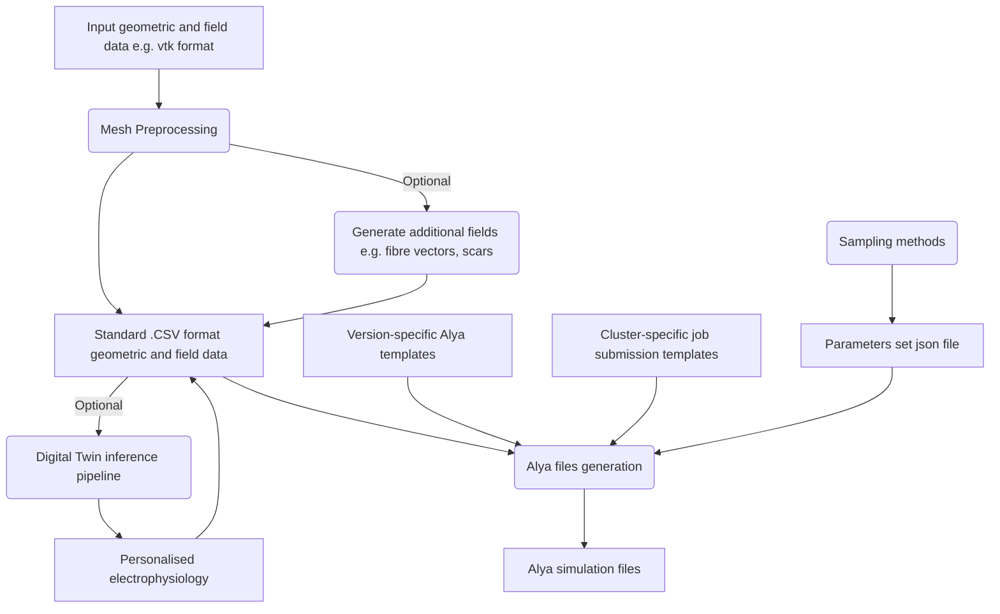

# Alya_input_setup

This pipeline handles the creation, monitoring, postprocessing, and analysis of Alya electromechanical or electrophysiological simulations. It is highly modular and adaptable to different supercomputing or cluster computing platforms, as well as to different version of Alya, and is designed to be able to deploy and analyse large volumes of simulations. 

Code structure is summarised in the following flowchart:

